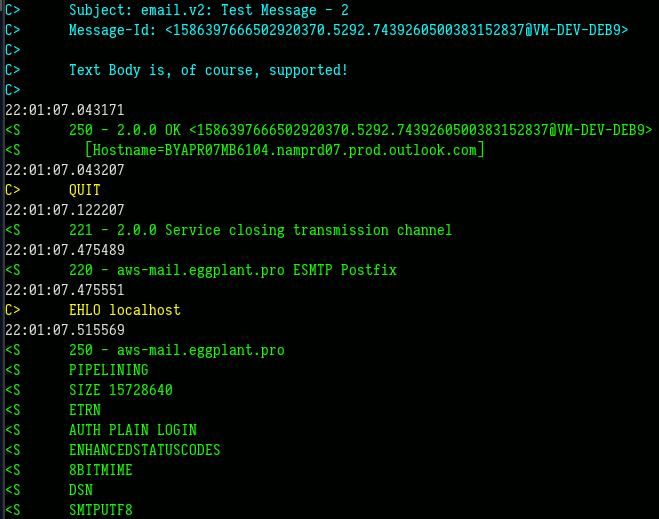

# email.v2
Yet another SMTP client!

[](https://godoc.org/github.com/BourgeoisBear/email.v2)




## Features

This package currently supports the following:

* From, To, Bcc, and Cc fields
* Email addresses in both "test@example.com" and "First Last &lt;test@example.com&gt;" format
* Text and HTML Message Body
* Attachments
* Read Receipts
* Custom Headers
* SMTP Logging
* Integrated Client Settings


## Installation

```go get github.com/BourgeoisBear/email.v2```


## Simple Usage

```go

oCfg := SMTPClientConfig{
  Server:   "mx.test.com",
  Port:     587,
  Username: "test@test.com",
  Password: "...",
  Mode:     ModeSTARTTLS,
  // SMTPLog:  "-",  // note: uncomment to log SMTP session to STDOUT
}

oEmail := NewEmail()
oEmail.From    = "test@test.com"
oEmail.To      = []string{"test_receiver@eggplant.pro"}
oEmail.Subject = "Test Message"
oEmail.Text    = []byte("Whoomp there it is!")

E := oCfg.SimpleSend(oEmail)
if E != nil { return E }

```


## Reasons for Fork

This is a fork of https://github.com/jordan-wright/email

* ripped out connection pooling (sending via long-term connections to SMTP
  servers has not been reliable)
* condensed multiple Send... methods into NewClient() & Send() to
  * send multiple messages from within a single established SMTP session
  * make direct use of outside net.Conn interfaces,
    so as to set dial and I/O deadlines
  * provide a more generic way of establishing unauthenticated,
    SSL, and STARTTLS connections
* added `LoginAuth` authentication interface for use with Office 365
* added `TextprotoLogged` for full logging of SMTP traffic


## Testing

To run unit tests, add the proper credentials to `email_test_settings.json` for
accounts you choose to test with.  Examples for O365, GMAIL, & CUSTOM have been
provided.
